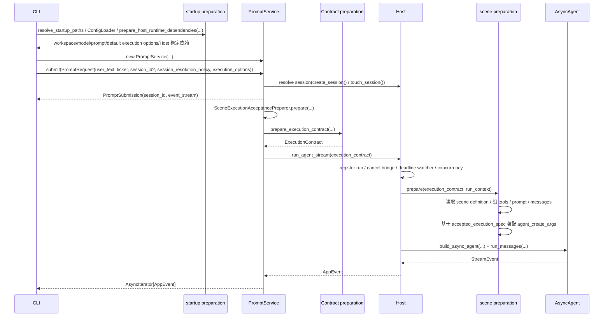
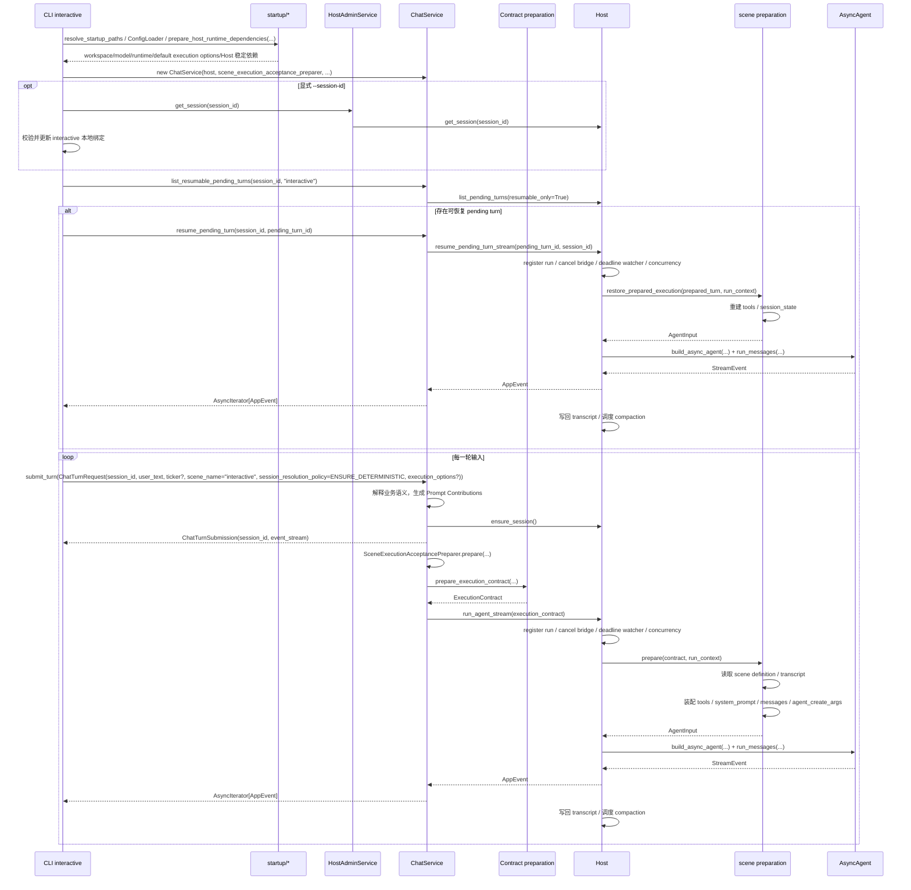

# Dayu 开发手册总览

`dayu/` 是 Dayu 的开发入口。本文档不复述包内实现细节，而是面向两类开发者说明当前系统的稳定边界、数据流转和扩展方式：

- 上层接入开发者：编写 `CLI / GUI / Web / FastAPI / WeChat` 适配层的开发者
- 扩展开发者：新增 `Service` 或工具的开发者

本文档以当前代码为准，只写：

- 设计目标
- 总体架构与主链时序
- 模块边界
- 核心契约与数据流转
- Host、多轮会话、Scene 机制
- 常见扩展入口

相关文档：

- [../docs/architect.md](../docs/architect.md)
- [engine/README.md](engine/README.md)
- [fins/README.md](fins/README.md)
- [config/README.md](config/README.md)

## 0.1 开发环境安装

开发环境以 Python 3.11 为基准。源码安装只面向开发者，不作为最终用户官方交付路径。建议直接使用受控 constraints 安装：

```bash
python3.11 -m venv .venv
source .venv/bin/activate
pip install -e ".[test,dev,browser]" -c constraints/lock-macos-arm64-py311.txt
```

说明：

- macOS Intel 开发环境改用 `constraints/lock-macos-x64-py311.txt`
- Linux 开发环境改用 `constraints/lock-linux-x64-py311.txt`
- Windows 开发环境改用 `constraints/lock-windows-x64-py311.txt`


如果为了专门验证最低支持边界，请使用：
```bash
pip install -e ".[test,dev,browser]" -c constraints/min-py311.txt
```

浏览器回退抓取是开发环境默认必备能力，因为它会直接影响 `web tools` 中 `fetch_web_page` 的表现；完成依赖安装后，还需要执行：

```bash
playwright install chromium
```

如需 PDF 渲染，还需要安装 `pandoc`。此外，渲染 HTML / PDF 仍建议安装 Google Chrome：

- macOS：`brew install pandoc`
- Ubuntu / Debian：`sudo apt-get install pandoc`
- Windows：`choco install pandoc` 或从 [pandoc 官网](https://pandoc.org/installing.html) 下载安装

## 0. 如果你想参与项目
- 定性分析模板 读起来机械感还很强，还没写出差异化：
  - 同一章节里，不同行业公司写出明显不同的判断路径。
  - 同一行业里，不同公司写出公司自己的特殊结构变量。
- 位于 Engine 的 web tools 现在的对抗challenge能力很弱，很多网站无法访问。
- 位于 Fins 的港股、A股财报下载功能尚未实现。
- GUI 尚未实现；Web UI 目前仍只有 FastAPI 骨架。
- WeChat UI 仅支持文本消息首版，还可添加更多好玩的功能。
- 财报电话会议记录音频转录文字后信息提取（起码要区分信息来自提问还是回答）尚未实现。
- 财报presentation信息提取尚未实现。
- 欢迎围绕以下方向提交 issue 或 PR：
  - 普通文件（非财报文件）信息提取还需要优化。
  - 优化 Fins 里的港股/A股/美股财报信息提取。
  - Anthropic 原生 API 支持。
  - Durable memory / Retrieval layer（ Memory只实现了working memory 和 episode summary ）。
  - FMP 工具（调研工作已做，见 [../docs/fmp_integration_research.md](../docs/fmp_integration_research.md) ）尚未实现。
  - 更多LLM 工具。

## 1. 设计目标

Dayu 的设计目标来自 [architect.md](../docs/architect.md) 的“设计目标”，当前可以压缩为四点：

- Dayu 采用“宿主强约束下的 `LLM in the loop`”，而不是把系统做成 `LLM on the loop` 的工作流编排器。
- 宿主必须显式拥有执行生命周期、资源边界和治理能力，LLM 只在宿主给定的边界内执行消息交互。
- 同一套宿主治理能力需要同时支撑普通 Agent 与金融专门 Agent。
- 系统设计目标是“稳定托管 Agent 运行”，而不是“把一次推理请求尽快发出去”。

因此，后文所有边界都服务于同一个北极星：

- 让 `Service` 只做业务解释
- 让 `Host` 只做托管执行
- 让 `Agent` 只做消息交互
- 让这三者之间通过稳定契约协同，而不是通过隐藏装配逻辑耦合

## 2. 总体架构

Dayu 当前稳定架构只有四层：


如果把执行过程展开，当前代码里的实际链路是：


这里要区分“层次”和“装配过程”：

- `UI -> Service -> Host -> Agent` 是稳定分层。
- `startup preparation` 不是新层，它是 `UI` 在启动期使用的 public 模块。
- `Contract preparation` 不是新层，它是 `Service` 内部使用的 public 模块。
- `prompting/` 不是新层，它是 `Host / Service` 复用的 prompt 渲染与装配公共模块。
- `scene preparation` 不是新层，它是 `Host` 内部使用的 public 模块。

几个关键判断：

- `UI` 决定调用哪个 `Service`，并把结果渲染给宿主用户。
- `UI` 可以在启动期一次准备稳定依赖，但不应该为一次 CLI 请求预先创建所有 `Service`；当前 CLI 按命令分支惰性创建所需 `Service`。
- `startup preparation` 只把启动期原始来源收敛成稳定依赖。
- `Service` 决定“这次业务上要做什么”。
- `Contract preparation` 只把 Service 已做出的决策收敛成 `Execution Contract`。
- `Host` 决定“这次执行如何被托管、追踪、取消、恢复和治理”。
- `Host` 默认内部子组件的装配权属于 `Host` 自己，而不属于 `UI`。
- prompt 模板条件块解析与变量替换归 `prompting/`，不归 `Engine`。
- `scene preparation` 只把 `Execution Contract` 与 Host 自有状态收敛成 `AgentInput`。
- `Agent` 不理解业务语义，只执行已经准备好的消息交互。

### 2.1 组件简要说明

- `UI`
  - 负责接入宿主入口，例如 `CLI / Web / FastAPI / WeChat`
  - 在启动期通过 `startup preparation` 拿稳定依赖
  - `dayu.cli` 当前固定拆成三层：`arg_parsing.py` 只负责参数定义，`main.py` 只负责顶层命令分发，`commands/` 负责各子命令执行；CLI 共享运行时装配真源继续集中在 `dependency_setup.py`
  - `dayu.wechat` 当前也固定拆成四层：`arg_parsing.py` 只负责参数定义与上下文解析，`runtime.py` 只负责 WeChat 运行时装配与 service helper，`commands/` 负责 `login / run / service` 子命令执行，`main.py` 只负责顶层分发
  - 调用 `dayu.services.startup_preparation` / `dayu.host.startup_preparation` 暴露的启动期 public API，收敛 `Host` 级稳定依赖
  - 不复制 `Host` 装配链，也不显式构造 `SQLiteSessionRegistry`、`SQLiteRunRegistry`、`SQLiteConcurrencyGovernor`、`DefaultScenePreparer`、`DefaultHostExecutor`
  - 显式 `new Service(...)`
  - 宿主管理类 UI 命令也只消费窄 `Service`（如 `HostAdminService`），不在请求期直接调用 `Host` 方法
  - interactive / web / wechat 这类 UI 适配层只消费各自稳定 `ServiceProtocol` 已声明的方法，不保留 `hasattr` 兼容分支去探测旧接口；对多轮 Chat 入口，CLI interactive、Web 和 WeChat 统一只走 `submit_turn()` / `list_resumable_pending_turns()` / `resume_pending_turn()` 这组公开契约
  - Host 事件订阅只依赖稳定事件包络，而不是把事件总线钉死为某个具体业务事件类；因此管理面 / SSE 可以同时转发 `AppEvent` 与 direct operation 的流式事件；当 direct operation 事件自带 `command` 判别字段时，SSE 也必须一并透传，不能压扁成只有 `type/payload` 的旧 `AppEvent` 形状
  - 对需要可靠出站交付的渠道路径，可显式 `new ReplyDeliveryService(...)`
  - 只为当前请求路径创建所需 `Service`，不维护覆盖所有命令的大型 runtime bundle
  - 在请求期只向 `Service` 传 `Request DTO`
- `Service`
  - 是唯一允许理解业务语义的一层
  - 把请求解释成一个明确业务动作
  - 产出 `Execution Contract`，再把它交给 `Host`
  - 在拿到 `Host` 终态结果后，决定当前路径是否显式使用 `Host` 的 `reply outbox` 能力
  - 只能依赖 `Host` 暴露的稳定能力协议与对外接口（public API），不能直接读取 `executor / session_registry / run_registry / concurrency_governor` 这类内部子组件
- `Host`
  - 是通用托管执行层，不是“Agent 专属壳”
  - 同时托管 Agent 子执行和 direct operation
  - 拥有 session、run、并发、取消、事件发布、多轮会话状态
  - 可选托管 `reply outbox` 真源与状态机，但不会在 internal success 时自动把 answer 写入 outbox
- `Agent`
  - 只关心 messages、工具、预算、取消信号和 trace 上下文
  - 不理解 `ticker`、场景语义、配置文件结构或业务流程

### 2.2 `dayu.cli prompt` 时序图

`dayu.cli prompt` 是最简单的一条 Agent 路径。当前时序如下：



这条链路里最重要的事实是：

- `ticker` 不会直接传给 `Agent`
- `ticker` 也不会进入 `Host Session` / `Host Run` 的结构化字段
- `model_name` 也不会原样传给 `Agent`
- `Service` 先把它们解释或收敛，再通过 `Execution Contract` 交给 `Host`
- `prompting/` 在 `Host / Service` 侧完成 prompt 渲染，`Engine` 只消费最终可执行的 prompt 文本

## 3. 模块边界

### 3.1 UI

`UI` 是 composition root。

它负责：

- 选择调用哪个 `Service`
- 通过 `startup preparation` 拿到稳定依赖
- 显式 `new Service(...)`
- 作为 composition root，把窄依赖显式注入各个 Web router / CLI 命令入口
- 在请求期构造 `Request DTO`
- 观察并渲染 `Service` 返回的事件流或结果

它不负责：

- 解释业务语义
- 直接驱动 `Agent`
- 解析 prompt scene
- 管理 run 生命周期

### 3.2 Service

`Service` 是唯一允许理解业务语义的一层。

它负责：

- 解释用户请求与领域参数
- 决定本次请求应该走哪条业务路径
- 决定使用哪个 `scene`
- 生成 `Prompt Contributions`
- 基于启动期稳定依赖与当前请求收敛出 `Execution Contract`
- 把 `Execution Contract` 提交给 `Host`
- 仅通过 `Host` 暴露的稳定协议与对外接口交互，不依赖 `Host` 具体实现或内部子组件属性

它不负责：

- 自己管理 run、session、取消、并发
- 自己拼最终 `messages`
- 自己构造 `AsyncAgent`
- 让 `Agent` 理解业务参数

### 3.3 Host

`Host` 是通用托管执行层。

它负责：

- Host Session
- Host Run
- 取消、恢复、并发治理
- 事件发布
- 多轮 transcript 与 memory
- `scene preparation`
- 把 `Execution Contract` 收敛为 `Agent` 可执行输入
- 为 direct operation 提供统一取消语义；同步路径只向上暴露 `HostedRunContext` 这类稳定窄边界，由 Service/Runtime 协作下传取消检查，不能把 Host 内部取消桥接细节泄漏给业务实现

它不负责：

- 理解 `ticker`、写作、审计、修复等业务语义
- 决定这次业务“要做什么”
- 回头理解 `Service` 私有的业务规则

### 3.4 Agent

`Agent` 是最低层消息执行器。

它负责：

- 消费最终 `messages`
- 在受限工具集合内执行工具调用
- 产出流式事件
- 记录 trace / tool trace

它不负责：

- 解释 `Request DTO`
- 解释 `Execution Contract`
- 理解 scene、ticker、文档范围、写作阶段
- 读取 `run.json`、`llm_models.json`

### 3.5 startup preparation

`startup preparation` 是启动期 public surface 的统称，当前分布在 `startup/`、`dayu.services.startup_preparation` 和 `dayu.host.startup_preparation`；它只服务于启动期，不进入请求期调用链。

它负责：

- 接收 `workspace_root`、`config_root`、默认 `ExecutionOptions`
- 解析路径与配置来源
- 准备 `ConfigLoader`、`PromptAssetStore`、`WorkspaceResources`、`ModelCatalog`
- 准备默认 `ResolvedExecutionOptions`
- 准备金融领域专用 `FinsRuntime`
- 调用 `Service` 暴露的 startup preparation API，收敛 `SceneExecutionAcceptancePreparer` 与共享 Host runtime 依赖
- 调用 `Host` 暴露的 startup preparation API，收敛 `HostStore path`、`lane config`
- 支持 UI 先准备稳定依赖，再按命令分支惰性创建所需 `Service`

它不负责：

- 构造 `Host`
- 构造 `Service`
- 直接实例化 `SceneDefinitionReader`、Conversation Policy 解析器等 Service 内部实现
- 直接读取 `DEFAULT_LANE_CONFIG` 这类 Host 内部常量
- 生成 `ExecutionContract`
- 生成 `AgentInput`

### 3.6 Contract preparation

`Contract preparation` 是 `Service` 内部使用的 public 模块。

它负责：

- 接收 Service 已经做出的业务决策
- 把这些决策收敛成 `ExecutionContract`
- 准备 `host_policy`
- 准备 `ScenePreparationSpec`
- 准备 `message_inputs`
- 写入 `accepted_execution_spec`

它不负责：

- 再次解释业务语义
- 组装最终 `ToolRegistry`
- 组装最终 `system_prompt` / `messages`
- 构造 `AsyncAgent`

### 3.7 scene preparation

`scene preparation` 是 `Host` 内部使用的 public 模块。

它负责：

- 按 `scene_name` 加载 scene 定义
- 按 scene manifest 的 `conversation.enabled` 判断是否进入多轮 transcript / memory 组装
- 基于 scene manifest、`selected_toolsets`、`execution_permissions` 组装最终工具集合
- 基于 `accepted_execution_spec` 与模型目录装配 `agent_create_args`
- 组装 `system_prompt`
- 组装单轮或多轮 `messages`
- 维护会话 transcript、memory 和 trace 上下文
- 返回 `AgentInput`

它不负责：

- 接受或拒绝 execution options
- 决定 scene
- 决定 prompt contributions
- 创建 Session 或 Run

### 3.8 workspace migrations

`workspace migrations` 是 `dayu-cli init` 在启动期针对**旧工作区**执行的一次性修复脚本集合，集中在 `dayu/cli/workspace_migrations/`。它与 §3.5 `startup preparation` 并列——都只服务于启动期、不进入请求期调用链——但职责是一次性的"把旧工作区就地升级到当前 schema"，而不是"为本次运行准备依赖"。

它负责：

- 向后扫描 `workspace/config/run.json`，在缺少新 schema 要求的 key 时补齐默认值，已有取值一律保留
- 向后扫描 `.dayu/host/dayu_host.db` 中的 `pending_conversation_turns.resume_source_json`，按当前 schema 原地改名旧 JSON key
- 每条规则一个模块、一个幂等函数，通过 `apply_all_workspace_migrations` 统一调度
- 只在规则实际生效时打印一行，供用户感知

它不负责：

- 维护数据库 schema 本身（`CREATE TABLE` 仍在 `dayu.host.host_store`）
- 保留旧 schema 的兼容读取路径——规则按 CLAUDE.md "全新 schema 起库"约束，**只向前迁移**
- 进入请求期——`dayu-cli` 任何非 `init` 命令都不会触发该目录

扩展约束：新增一次性迁移时，只在 `dayu/cli/workspace_migrations/` 下新增模块 + 登记到 runner，禁止把规则写回 `dayu/cli/commands/init.py`。

## 4. 核心契约

Dayu 在 Agent 路径上稳定使用五类数据契约：

- `UI -> Service` 请求契约：`Request DTO`
- `Service -> UI` 流式输出契约：`AppEvent`
- `Service -> UI / Host -> Service` 结果契约：`AppResult`
- `Service -> Host` 执行契约：`Execution Contract`
- `Host -> Agent` 最低可执行输入：`Agent Input`

按边界分组来看：

- `UI <-> Service`
- `Service -> Host`
- `Host -> Agent`

### 4.1 `UI <-> Service`

#### 4.1.1 `Request DTO`

`Request DTO` 只回答一个问题：用户这次显式提交了什么。

典型字段包括：

- 用户输入文本
- 显式业务参数，例如 `ticker`
- 通用执行显式参数，例如 `model_name`、`temperature`、`max_iterations`

这里要区分两类参数：

- 领域显式参数
  - 例如 `ticker`
  - 只能由需要该领域语义的 `Service` 理解
- 通用执行显式参数
  - 例如 `model_name`
  - 也必须先进入 `Service`
  - 由具体 `Service` 决定是否接受、如何覆盖默认策略

当前 `Request DTO` 族的 schema 如下：

```python
@dataclass(frozen=True)
class ChatTurnRequest:
    user_text: str
    session_id: str | None = None
    ticker: str | None = None
    execution_options: ExecutionOptions | None = None
    scene_name: str | None = None
    session_resolution_policy: SessionResolutionPolicy = SessionResolutionPolicy.AUTO


@dataclass(frozen=True)
class PromptRequest:
    user_text: str
    ticker: str | None = None
    session_id: str | None = None
    execution_options: ExecutionOptions | None = None
    session_resolution_policy: SessionResolutionPolicy = SessionResolutionPolicy.AUTO


@dataclass(frozen=True)
class WriteRequest:
    write_config: WriteRunConfig
    execution_options: ExecutionOptions | None = None
```

其中：

- `session_id` 在 `chat` / `prompt` 请求里是可选的
- 首轮请求可不传 `session_id`，由 `Service` 在内部创建 Host session
- `Service.submit_*()` 必须先完成请求级同步校验，再决定是否创建 Host session；像空输入、非法 scene、direct operation 的空 `ticker` 这类客户端错误，必须在返回 submission 句柄前失败，不能先受理再让后台任务首轮消费时报错
- `session_resolution_policy` 只声明“这次请求希望怎样解析 session”
- `source` 不再作为请求字段暴露；它是 `Service` 构造时持有的固定上下文，用于写入 Host session provenance
- `chat` / `prompt` / `fins` 对 UI 返回的是 `*Submission(session_id, event_stream|execution)` 句柄，而不是让 UI 先去创建 Host session

其中最常被 UI 显式覆盖的 `ExecutionOptions` schema 如下：

```python
@dataclass(frozen=True)
class ExecutionOptions:
    model_name: str | None = None
    temperature: float | None = None
    debug_sse: bool = False
    debug_tool_delta: bool = False
    debug_sse_sample_rate: float | None = None
    debug_sse_throttle_sec: float | None = None
  tool_timeout_seconds: float | None = None
    max_iterations: int | None = None
    fallback_mode: str | None = None
    fallback_prompt: str | None = None
    max_consecutive_failed_tool_batches: int | None = None
    max_duplicate_tool_calls: int | None = None
    duplicate_tool_hint_prompt: str | None = None
    web_provider: str | None = None
    trace_enabled: bool | None = None
    trace_output_dir: Path | None = None
    toolset_configs: tuple[ToolsetConfigSnapshot, ...] = ()
    toolset_config_overrides: tuple[ToolsetConfigSnapshot, ...] = ()
    doc_tool_limits: DocToolLimits | None = None
    fins_tool_limits: FinsToolLimits | None = None
    web_tools_config: WebToolsConfig | None = None
```

  其中 `toolset_configs` 是唯一的跨层工具配置真源，`toolset_config_overrides` 是请求层对该真源的稀疏覆盖表达；`doc_tool_limits / fins_tool_limits / web_tools_config` 之所以仍出现在 `ExecutionOptions` 上，只是为了保留请求入口的人体工学简写。它们在 `ExecutionOptions` 构造时就会立即被收敛进 `toolset_configs`，后续 `Service -> Host -> snapshot` 链路不再把这些旧字段当作独立跨层契约继续传播。

#### 4.1.2 `AppEvent`

`AppEvent` 是 `Service -> UI` 的流式事件契约。

它回答的问题是：

- 这次执行产生了什么增量
- 当前是内容、推理、工具、告警还是错误
- UI 应如何逐步渲染本轮输出

它的 schema 如下：

```python
class AppEventType(Enum):
    CONTENT_DELTA = "content_delta"
    REASONING_DELTA = "reasoning_delta"
    FINAL_ANSWER = "final_answer"
    TOOL_EVENT = "tool_event"
    WARNING = "warning"
    ERROR = "error"
    METADATA = "metadata"
    DONE = "done"


@dataclass
class AppEvent:
    type: AppEventType
    payload: Any
    meta: dict[str, Any] = field(default_factory=dict)
```

`Service` 对 `UI` 的典型返回类型不是单个 `AppEvent`，而是：

```python
AsyncIterator[AppEvent]
```

对需要先拿到会话句柄再异步消费事件的 UI（例如 Web SSE、CLI 多轮），`Service` 返回的稳定 public contract 是：

```python
@dataclass(frozen=True)
class ChatTurnSubmission:
    session_id: str
    event_stream: AsyncIterator[AppEvent]


@dataclass(frozen=True)
class PromptSubmission:
    session_id: str
    event_stream: AsyncIterator[AppEvent]
```

#### 4.1.3 `AppResult`

`AppResult` 是聚合后的结果契约。

它主要用于：

- `Host -> Service` 的 `run_agent_and_wait(...)`
- 写作 pipeline 等需要一次性消费最终结果的场景
- 不适合逐 token 渲染的同步收口路径

它的 schema 如下：

```python
@dataclass
class AppResult:
    content: str
    errors: list[str]
    warnings: list[str]
    degraded: bool = False
```

### 4.2 `Service -> Host`

#### 4.2.1 `Execution Contract`

`Execution Contract` 是 `Service -> Host` 的执行决策。

它回答的问题是：

- 这次执行要跑哪个 `scene`
- 宿主应如何托管这次执行
- scene preparation 需要哪些已解析的装配信息
- Host 应基于哪些已接受执行规格继续机械装配

完整 schema 如下：

```python
@dataclass(frozen=True)
class ExecutionWebPermissions:
    allow_private_network_url: bool = False


@dataclass(frozen=True)
class ExecutionDocPermissions:
    allowed_read_paths: tuple[str, ...] = ()
    allow_file_write: bool = False
    allowed_write_paths: tuple[str, ...] = ()


@dataclass(frozen=True)
class ExecutionPermissions:
    web: ExecutionWebPermissions = field(default_factory=ExecutionWebPermissions)
    doc: ExecutionDocPermissions = field(default_factory=ExecutionDocPermissions)


@dataclass(frozen=True)
class ScenePreparationSpec:
    selected_toolsets: tuple[str, ...] = ()
    execution_permissions: ExecutionPermissions = field(default_factory=ExecutionPermissions)
    prompt_contributions: dict[str, str] = field(default_factory=dict)


@dataclass(frozen=True)
class AcceptedExecutionSpec:
  model: AcceptedModelSpec
  runtime: AcceptedRuntimeSpec = field(default_factory=AcceptedRuntimeSpec)
  tools: AcceptedToolConfigSpec = field(default_factory=AcceptedToolConfigSpec)
  infrastructure: AcceptedInfrastructureSpec = field(default_factory=AcceptedInfrastructureSpec)


@dataclass(frozen=True)
class AcceptedModelSpec:
  model_name: str
  temperature: float | None = None


@dataclass(frozen=True)
class AcceptedRuntimeSpec:
  runner_running_config: dict[str, Any] = field(default_factory=dict)
  agent_running_config: dict[str, Any] = field(default_factory=dict)


@dataclass(frozen=True)
class AcceptedToolConfigSpec:
  toolset_configs: tuple[ToolsetConfigSnapshot, ...] = ()


@dataclass(frozen=True)
class AcceptedInfrastructureSpec:
  trace_settings: Any | None = None
  conversation_memory_settings: Any | None = None


@dataclass(frozen=True)
class ExecutionHostPolicy:
    session_key: str | None = None
    business_concurrency_lane: str | None = None
    timeout_ms: int | None = None
    resumable: bool = False


@dataclass(frozen=True)
class ExecutionMessageInputs:
    user_message: str | None = None

@dataclass(frozen=True)
class ExecutionContract:
    service_name: str
    scene_name: str
    host_policy: ExecutionHostPolicy
    preparation_spec: ScenePreparationSpec
    message_inputs: ExecutionMessageInputs
    accepted_execution_spec: AcceptedExecutionSpec
    execution_options: Any | None = None
    metadata: ExecutionDeliveryContext = field(default_factory=empty_execution_delivery_context)
```

  `AcceptedToolConfigSpec` 现在只把通用 `toolset_configs` 作为稳定真源；Host / scene preparation 不再继续传递专用工具配置字段。

其中：

- `host_policy`
  - 描述 Host Session、并发 lane、超时、是否可恢复
  - `timeout_ms=None` 表示该参数已被 Service 受理，但当前不启用 deadline；真正的超时取消语义由 Host 执行
  - 对 `conversation.enabled=true` 的 scene，Service 当前默认写入 `resumable=True`；Host 仍会在 scene gate 上做最终校验
- `preparation_spec`
  - 描述 scene preparation 需要的机械装配信息
- `message_inputs.user_message`
  - 当前轮用户输入
- `accepted_execution_spec`
  - 描述 Service 已接受的四组执行结果：模型选择、运行时快照、工具域配置、基础设施配置
  - 其中工具域配置以 `accepted_execution_spec.tools.toolset_configs` 为真源；若某个 toolset 需要专用配置对象，由对应 registrar adapter 在包内自行反解
  - 如果 web toolset config 中声明了 `allow_private_network_url`，`Contract preparation` 仍必须显式同步写入 `execution_permissions.web.allow_private_network_url`；动态权限收窄以 `execution_permissions` 为准，不能把它继续表述成 `AcceptedToolConfigSpec` 上的独立旧字段

### 4.3 `Host -> Agent`

#### 4.3.1 `Agent Input`

`Agent Input` 是 `Host` 内部的最低可执行输入。

它回答的问题是：

- 送给 Agent 的最终 prompt 和 messages 是什么
- 这次执行最终能用哪些工具
- Agent 应按什么运行参数被创建
- Host 要把哪些会话状态、trace 与取消上下文一起交给 Agent

完整 schema 如下：

```python
@dataclass(frozen=True)
class AgentCreateArgs:
    runner_type: str
    model_name: str
    max_turns: int | None = None
    max_context_tokens: int | None = None
    max_output_tokens: int | None = None
    temperature: float | None = None
    runner_params: dict[str, Any] = field(default_factory=dict)
    runner_running_config: dict[str, Any] = field(default_factory=dict)
    agent_running_config: dict[str, Any] = field(default_factory=dict)


@dataclass(frozen=True)
class AgentInput:
    system_prompt: str
    messages: list[dict[str, Any]]
    tools: Any | None = None
    agent_create_args: AgentCreateArgs = field(
        default_factory=lambda: AgentCreateArgs(runner_type="", model_name="")
    )
    session_state: Any | None = None
    runtime_limits: dict[str, Any] = field(default_factory=dict)
    cancellation_handle: Any | None = None
    tool_trace_recorder_factory: Any | None = None
    trace_identity: dict[str, Any] | None = None
```

它只在 `Host / scene preparation` 内部流转，不作为 Engine 对外公共接口。

## 5. 数据流转重点

### 5.1 `--ticker` 怎么“传到” LLM

`--ticker` 不会原样传给 `Agent`。当前稳定链路是：

```text
CLI/Web/WeChat
-> Request DTO.ticker
-> Service 解释 ticker 的业务含义
-> Service 生成 Prompt Contributions["fins_default_subject"]
-> scene preparation 按 scene context slot 追加到 system_prompt 尾部
-> Agent 只看到最终 system_prompt
```

对 `Agent` 而言，不存在“收到一个 ticker 参数”这件事。它只收到已经降解后的 prompt 文本。
对 `Host` 而言，也不存在“结构化保存一个 ticker 字段”这件事；`ticker` 的跨轮保持与恢复属于上层自己的状态职责。

### 5.2 `--model-name` 怎么传到 Agent

`--model-name` 也不会原样传给 `Agent`。

当前稳定链路是：

```text
UI 显式参数
-> Request DTO.execution_options.model_name
-> Service 调用 SceneExecutionAcceptancePreparer
-> Service 产出 accepted_execution_spec
-> Host 在 scene preparation 内部机械装配 agent_create_args
-> Host 使用 agent_create_args 构造 AsyncAgent / AsyncRunner
```

因此：

- `--ticker` 最终降解成 prompt 文本
- `--model-name` 最终降解成 `accepted_execution_spec`，再由 Host 落成 `AgentCreateArgs`

两者都不会以原始请求字段形态进入 `Agent`

### 5.3 Fins 两类 dispatch：ticker → pipeline 与 document → processor

Fins 包里存在两条互不相同的 dispatch：一条决定**长事务走哪条 pipeline**（download / upload / process），另一条决定**读取某份文档时用哪个 processor**（tool calling 与 pipeline 内部都会触发）。它们的键、真源、消费者都不同，不能互相代替。

#### 5.3.1 ticker → pipeline（按 market 分派）

进入点有两条：

- **CLI `--ticker`**（`dayu.cli` 的 `download / upload_filings_from / upload_filing / upload_material / process / process_filing / process_material`）：`cli_support.py::_build_pipeline_for_ticker` → `normalize_ticker(ticker)` → `get_pipeline_from_normalized_ticker(...)`。
- **Tool calling 触发的长事务**（LLM 调用 ingestion 工具由 `IngestionJobManager` 调度）：`toolset_registrars.py` → `FinsRuntime.build_ingestion_service_factory()` 返回 `ticker -> FinsIngestionService` 闭包；闭包内部对每个 job 的 `ticker` 执行 `normalize_ticker`，再通过 `dayu/fins/pipelines/factory.py::build_ingestion_service_from_normalized_ticker` 拿到对应 pipeline 的长事务服务。

两条路径最终落在同一条分派规则上：

```text
NormalizedTicker.market == "US"            → SecPipeline
NormalizedTicker.market in {"HK", "CN"}    → CnPipeline
其它                                        → ValueError("不支持的 market: …")
```

分派真源是 `dayu/fins/pipelines/factory.py::get_pipeline_from_normalized_ticker`。CLI 路径直接复用该真源；tool calling 路径通过 `build_ingestion_service_from_normalized_ticker` 间接复用同一真源，不再维护独立的 `if US … if CN/HK … else raise` 分支，新增 market 时只需改一处。

关键事实：

- pipeline 分派只看 `NormalizedTicker.market`，不看 ticker 字面量或字母数字模式。
- 同一 `FinsRuntime` 实例里，CLI 与 tool 两路共享同一份 `ProcessorRegistry` 与仓储实例，pipeline 构造时把它们逐项注入。
- `SecPipeline` 已不再接受识别器注入参数；ticker 的市场识别统一由 `dayu/fins/ticker_normalization.py::normalize_ticker` 真源完成。

#### 5.3.2 document → processor（按 source + form_type + media_type 分派）

这条 dispatch 发生在**读取某份已入库文档**时，由 `FinsToolService._create_processor_for_document(ticker, document_id)`（tool calling 路径）或 pipeline 内部 `resolve_processor_*`（长事务路径）触发，调用的都是同一张 `ProcessorRegistry`。

触发链路（tool 视角）：

```text
LLM tool call
  → FinsToolService._create_processor_for_document(ticker, document_id)
  → SourceRepository.get_primary_source(ticker, doc_id, source_kind)   ← 拿到 Source 抽象
  → SourceRepository.get_source_meta(...)                              ← 读 form_type
  → ProcessorRegistry.create_with_fallback(
        source=source,
        form_type=form_type,
        media_type=source.media_type,
    )
```

分派由三键组合决定：

- `source`：仓储提供的 `Source` 抽象，其 `supports()` 判定 SEC filing 结构、本地文件、扩展名等。
- `form_type`：`source_meta["form_type"]`，驱动 SEC 表单专项处理器（10-K / 10-Q / 20-F / 8-K / 6-K / SC13 / DEF 14A）。
- `media_type`：`source.media_type`，驱动 Docling（PDF）/ Markdown / BS（HTML）等通用处理器。

`ProcessorRegistry.resolve_candidates()` 遍历全部注册项调用 `processor_cls.supports(source, form_type, media_type)`，按 `priority` 降序产出候选；`create_with_fallback` 取第一个实例化成功的候选，**构造器抛异常**时自动回退到下一候选并触发 `on_fallback` 回调。

`build_fins_processor_registry()` 当前的优先级锚点：

| Priority | 角色 | 代表处理器 |
|---:|---|---|
| 200 | SEC 表单 BS 主路径 | `BsSc13FormProcessor` / `BsSixKFormProcessor` / `BsDef14AFormProcessor` / `BsEightKFormProcessor` / `BsTenKFormProcessor` / `BsTenQFormProcessor` / `BsTwentyFFormProcessor` |
| 190 | SEC 表单 edgartools 回退 | `Sc13FormProcessor` / `Def14AFormProcessor` / `EightKFormProcessor` / `TenKFormProcessor` / `TenQFormProcessor` / `TwentyFFormProcessor` |
| 120 | SEC 通用兜底 | `SecProcessor` |
| 100 | 文档格式通用 | `FinsDoclingProcessor`（PDF）、`FinsMarkdownProcessor`（Markdown） |
| 80 | HTML 通用 | `FinsBSProcessor` |
| —  | engine 基座 | `build_engine_processor_registry()` 注入的通用处理器 |

关键事实：

- processor 分派**不看 market、不看 ticker**；CN / HK 文档当前直接走通用 Docling / Markdown / BS 处理器，没有 CN 特化专项处理器——若未来需要 A 股年报专项路径，应在注册表中新增按 form_type + source 判定的注册项，而不是回退到按 market 硬分支。
- tool calling 路径**不经过 `FinsIngestionService` / `SecPipeline`**；它直接复用共享 `ProcessorRegistry`。因此 tool 路径读取文档时不会触发 pipeline 分派，但**会**受 processor 分派规则的全量约束。
- 同一 `FinsRuntime` 内 tool 与 pipeline **共享同一份 `ProcessorRegistry`**（在 `DefaultFinsRuntime.create` 时 `build_fins_processor_registry()` 一次构建），注册顺序与优先级在 runtime 初始化时锁定。
- 若仓储 `form_type` 字段缺失，SEC 专项处理器会在 `supports()` 阶段全部拒绝，实际命中 `SecProcessor(120)` 或更低优先级的通用处理器——这是当前分派的一个已知脆弱点，依赖 ingestion 期正确写入 `form_type`。

## 6. Host

Host 是 Dayu 的通用托管执行层。它的价值不在于“帮 Service 调一下 Agent”，而在于把一次执行真正收敛成可治理、可观察、可取消、可恢复、可补投递的宿主能力。

当前 Host 可以稳定理解为一组能力集合，而不是一个单纯的数据中转对象：

- Session 能力：统一长期会话身份。
- Run 能力：统一一次执行尝试的生命周期。
- 并发治理能力：为不同 lane 提供限流与资源隔离。
- 事件发布能力：把执行事件稳定暴露给 UI。
- timeout 能力：在宿主侧收敛 deadline，而不是让 Agent 自己猜超时。
- cancel 能力：把“取消意图”和“取消终态”分离并统一收口。
- resume 能力：把 conversation turn 恢复真源固定在 Host。
- 多轮会话托管能力：统一 transcript、memory、compaction 调度。
- reply outbox 能力：把出站交付真源作为可选宿主能力托管。

默认实现上，这些能力由 `Host` 内部拥有的一组子组件共同完成，例如 session registry、run registry、并发治理器、pending turn store、reply outbox store、event bus 和默认执行器；`UI` 只消费启动期 public API 返回的 `Host`，不负责复制或拆开这些默认内部实现。

### 6.1 Session 能力

作用：

- 给一次长期对话或交互路径提供稳定 `session_id`。
- 让 CLI、Web、WeChat、多轮 transcript、事件订阅共用同一套会话身份。
- 把“哪一轮属于哪条会话”固定在 Host，而不是让各个 UI 自己定义第二套 session 体系。

实现机制：

- Dayu 当前只有一个 session 概念，就是 `Host Session`。
- `Service` 在提交执行前通过 `Host.create_session()`、`ensure_session()`、`touch_session()` 这类对外接口处理会话身份。
- `RunRecord.session_id`、conversation transcript、session 级事件订阅都挂在这套 `Host Session` 之下。
- `Host Session` 只持有托管执行所需的通用字段，例如 `session_id`、`source`、`state`、`scene_name`、时间戳和非结构化 `metadata`，不持有 `ticker` 之类业务字段。
- 如果业务要跨轮保留 `ticker` 等领域参数，应该由对应 UI / Service 自己持有，而不是把领域状态塞回 Host session。

### 6.2 Run 能力

作用：

- 为每次托管执行分配权威 `run_id`。
- 统一 run 的创建、启动、成功、失败、取消终态。
- 让一次执行拥有清晰的宿主级上下文，而不是散落在 Service 和 Agent 之间。

实现机制：

- 每次 `run_agent_stream()`、`run_agent_and_wait()` 或其它被 Host 托管的 operation，都会先在 run registry 里登记 run。
- `Host Run` 是“一次执行尝试”，不是长期会话，也不是 Agent 内部 iteration。
- `DefaultHostExecutor` 在 run 开始时统一完成四件事：注册 run、建立取消桥、建立 deadline watcher、按需获取并发许可。
- `run_id` 由 Host 生成后作为执行级上下文传给 Agent；Agent 不自己发明 run identity。
- `Host Run` 只保存 `run_id`、`session_id`、`service_type`、`scene_name`、状态、时间戳和通用 `metadata`，不结构化持久化 `ticker` 这类业务字段。

### 6.3 并发治理能力

作用：

- 控制不同执行 lane 的并发上限。
- 防止某个场景或某类执行把宿主资源打满。
- 把“能不能开始跑”从业务判断里剥离出来，固定成宿主治理能力。

实现机制：

- `Service` 只在 `ExecutionHostPolicy.business_concurrency_lane`（以及 `HostedRunSpec.business_concurrency_lane`）里声明这次执行要占用的**业务** lane，例如 `write_chapter`、`sec_download`。
- Host 自治 lane `llm_api` 由 `DefaultHostExecutor` 根据调用路径自动叠加（`run_agent_stream` / `run_prepared_turn_stream` 路径必叠加；`run_operation_*` 路径不叠加），Service 代码不出现 `"llm_api"` 字面量、也不参与是否加 llm_api 的业务判断。
- 同一次 run 可能同时持有多条 lane 的 permit：`DefaultHostExecutor` 在 run 启动时把全部必需 lane 按字母序传给 `ConcurrencyGovernorProtocol.acquire_many`，由 governor 在**单个持久化事务**内完成"全部 lane 额度检查 + 全部 permit 写入"，要么全拿要么全不拿；结束时按逆序释放。进程在 acquire_many 期间被 SIGKILL / OOM 杀死时，事务未 COMMIT 等于未写，不会残留半截 permit。executor 层不再承担多 lane 之间的 permit 回滚逻辑。
- `ConcurrencyGovernor` 的 lane 配置由 Host 启动期聚合：Host 默认（只含 `llm_api`）→ Service 业务默认（`SERVICE_DEFAULT_LANE_CONFIG`，含 `write_chapter`、`sec_download`）→ `run.json.host_config.lane` → 显式覆盖，后者覆盖前者。
- 业务层要读取 lane 上限时走 `HostGovernanceProtocol.get_all_lane_statuses()`（例如写作流水线读 `write_chapter.max_concurrent` 作为 in-process ThreadPoolExecutor 的 worker 上限，保持进程内并发与跨进程 permit 数同源）。

### 6.4 事件发布能力

作用：

- 把 Agent 执行产生的流式事件稳定暴露给上层 UI。
- 支撑 CLI 流式打印、Web SSE、管理面观察等宿主视图。
- 让 UI 不需要直接理解 Engine 原始流事件。

实现机制：

- Agent 产出的 stream event 会先被 Host 映射成 `AppEvent`。
- `DefaultHostExecutor` 在事件流经过时按需发布到 event bus，并同时把 `AppEvent` 返回给 `Service`。
- `Host` 对外暴露的是 run / session 级订阅能力，而不是把 event bus 内部对象泄漏给 UI。

### 6.5 timeout 能力

作用：

- 让执行 deadline 成为宿主规则，而不是某个具体 Agent 或工具实现的偶然行为。
- 保证 timeout 会被收敛成明确的 run 取消原因，便于恢复、管理面展示和后续治理。

实现机制：

- `Service` 只在 `ExecutionContract.host_policy.timeout_ms` 里声明“这次执行接受的 deadline”。
- `DefaultHostExecutor` 在 run 启动时创建 `RunDeadlineWatcher`。
- watcher 内部用 `threading.Timer` 计时；到点后不会直接把 run 改终态，而是先调用 `run_registry.request_cancel(..., cancel_reason=TIMEOUT)` 记录取消意图，再触发进程内 `CancellationToken.cancel()`。
- 执行链随后在 Host 生命周期边界统一把 run 收敛为 `CANCELLED`，并写入最终 `cancel_reason=timeout`。
- 这意味着 `timeout_ms=None` 只是“不启用 deadline”，不是把 timeout 逻辑下放给 Agent。

### 6.6 cancel 能力

作用：

- 支持 UI、管理面或宿主内部逻辑对运行中执行发出取消请求。
- 区分“已经请求取消”与“已经收口为取消终态”，避免状态语义混乱。
- 支撑跨线程 / 跨进程可见的取消传播。

实现机制：

- 取消分成两层：取消意图和取消终态。
- `request_cancel()` 只会在 run registry 中写入 `cancel_requested_at` 和 `cancel_requested_reason`，不会直接把 state 改成 `CANCELLED`。
- `CancellationBridge` 在后台线程轮询 run 状态；一旦发现 `cancel_requested_at` 已写入，就触发进程内 `CancellationToken`。
- `DefaultHostExecutor` 在流式事件循环、异常收口和同步执行边界统一检查 `token.is_cancelled()` 或 `run_registry.is_cancel_requested(run_id)`。
- 真正的终态写入由 Host 统一通过 `_finalize_cancelled()` 收敛，最终写成 `RunState.CANCELLED` 和明确的 `cancel_reason`。
- 这样管理面和 API 可以同时看到“已请求取消但尚未退出”和“已完成取消收口”两层信息。

### 6.7 resume 能力

作用：

- 让多轮聊天在中断、失败或 timeout 后可以按 Host 规则恢复。
- 把恢复真源固定在 Host，而不是 transcript、UI 本地状态或渠道侧自定义逻辑。
- 保证恢复重放的是原始已受理执行，而不是“现在重新猜一遍应该怎么跑”。

实现机制：

- V1 resume 的真源是独立的 pending `conversation turn` 仓储，不是 transcript。
- `DefaultHostExecutor` 在 resumable turn 被 Host 接受后会立即登记 pending turn，状态先进入 `accepted_by_host`；scene preparation 成功后升级为 `prepared_by_host`；收到本轮 Agent 的首个流事件后再推进到 `sent_to_llm`。
- pending turn 持久化的是 Host 自己的恢复真源，而不是回退到 Service 的 `ExecutionContract` snapshot：`accepted_by_host` 阶段保存 Host-owned accepted snapshot，`prepared_by_host` / `sent_to_llm` 阶段保存 Host-owned prepared snapshot；后者包含最终 system prompt、messages、AgentCreateArgs、工具权限、`toolset_configs` 与多轮 transcript 快照。
- Host 恢复时不是继续旧 run，而是在同一 `session` 下创建一个新 run：`accepted_by_host` 会重新进入 scene preparation，`prepared_by_host` / `sent_to_llm` 则直接从 prepared snapshot 重建执行。
- Host 对 Service 暴露的是稳定的 pending turn 公开摘要与直接恢复入口，而不是内部仓储记录类型或 `ExecutionContract`。
- `Host.resume_pending_turn_stream()` 会统一做 gate 校验：
  - 请求里的 `session_id` 必须与 pending turn 自身归属完全一致，禁止跨 session 恢复。
  - 只有 `resumable=True` 且有完整 `resume_source_json` 的记录才能恢复。
  - `source_run.state=FAILED` 可以恢复。
  - `source_run.state=CANCELLED` 且 `cancel_reason=timeout` 可以恢复。
  - `CREATED / QUEUED / RUNNING / SUCCEEDED` 一律不能恢复。
  - `user_cancelled` 也不能恢复。
  - Host 会把恢复失败次数作为 pending turn 真源的一部分持久化；默认最多允许恢复 `3` 次，达到上限后直接删除该 pending turn。
- pending turn 只属于执行真源：
  - 成功完成后立即删除。
  - 失败时如果 scene 不可恢复则删除；可恢复则保留。
  - timeout 取消且 scene 可恢复时保留；其它取消则删除。
  - prepare 阶段 timeout / failure 也属于可恢复范围，因此 accepted snapshot 不能丢失。
- `interactive` 和 `wechat` 这类 UI 路径只能通过 `Service` 暴露的 resume/list 入口使用这项能力，不能直接读写 Host 内部仓储。

### 6.8 多轮会话托管能力

作用：

- 统一多轮 transcript、working memory、episode summary 和 compaction 调度。
- 把“历史消息怎么裁剪、何时压缩、压缩后如何再回放”固定成 Host 规则。
- 让 Agent 只看到最终 messages，而不感知 transcript 存储和压缩机制。

实现机制：

- 多轮会话托管由 `scene preparation` 和 conversation memory 组件完成，属于 Host 能力的一部分。
- Host 在进入 Agent 之前读取 transcript、构建 memory block、选择 working memory，并把当前轮用户消息与 system prompt 一起装配成最终 messages。
- 当前轮完成后，Host 再负责把结果写回 transcript，并调度后台 compaction。
- 这部分具体机制见后文“8. 多轮会话机制”；这里要强调的是：多轮会话属于 Host，不属于 Agent，也不应该回退给 UI 自己管理。

### 6.9 三套真源与 reply outbox 能力

从渠道侧看，聊天主链可以简化为：

`User -> 渠道 UI -> Service -> Host -> Service -> 渠道 UI -> User`

这里必须区分三套真源：

- 入站交付真源：回答“用户消息是否已经被系统可靠拿到”，属于 `UI` / 渠道适配层。
- 执行真源：回答“这条请求在 Host 内是否还未完成、是否可恢复、是否已经 internal success”，属于 `Host`。
- 出站交付真源：回答“final answer 是否已经可靠送达用户”，可以作为 `Host` 的一项可选通用能力被托管。

reply outbox 这项能力的作用是：

- 把“最终回复是否已交付”从 pending turn 里拆出来，形成独立真源。
- 支撑发送重试、渠道回执、补投递和交付状态查询。
- 让 `interactive` 这类不需要可靠出站补投递的路径可以完全不用它；让 `web`、`wechat` 等路径按需显式启用。

reply outbox 的实现机制是：

- Host 侧有独立 `reply_outbox` 仓储和状态机，状态包括 `pending_delivery`、`delivery_in_progress`、`delivered`、`failed_retryable`、`failed_terminal`。
- Host store 里有独立 `reply_outbox` 表，并对 `delivery_key` 做唯一约束，对 `source_run_id` 建索引。
- `delivery_key` 是业务显式提供的幂等键；相同 key 重复提交时，只允许负载完全一致，避免覆盖真源。
- Host 对外接口提供 `submit / get / list / claim / mark_delivered / mark_failed` 这组稳定能力，但 Host internal success 不会自动入队。
- SQLite 默认实现里的 `claim` 是数据库级原子状态迁移：只有 `pending_delivery` 或 `failed_retryable` 记录才能成功领取发送权，避免多个投递 worker 同时发送同一条回复。
- `ack` 只允许确认已经处于 `delivery_in_progress` 的记录；不能绕过 `claim` 直接把 `pending_delivery` 或失败态记录写成 `delivered`。
- 正确主链是：Host 先把 terminal result 返回给 `Service`，再由 `Service` 显式决定是否调用 reply outbox。
- 当前 Phase 2 已进一步把这条边界固定为 `ReplyDeliveryService`：`web`、`wechat` 等渠道适配层通过 Service API 提交 delivery、claim 发送权并回写 delivered / failed，而不是直接触碰 Host 内部仓储。
- delivery 的重试上限属于 UI / worker 自己的策略，不属于 Host 配置；例如 WeChat worker 当前默认最多发送 `3` 次，并把 `iLink ret != 0`、HTTP `4xx` 与缺少 delivery 目标字段的失败直接收口为 `failed_terminal`。
- 对外暴露 reply outbox REST API 时，也必须保留同样的独占领取语义，正确顺序是 `list -> claim -> 实际发送 -> ack/nack`。

当前实现还刻意停在“独占领取发送权”这一层，没有把 `ack / nack` 绑定到某个领取者身份。这意味着它已经能防止多个 worker 同时开始发送同一条 reply，但还没有进一步约束“只有当前领取者才能回写终态”。

如果后续需要更强的分布式 delivery worker 保障，推荐沿 reply outbox 真源继续增强 `lease / owner token` 机制，而不是把这层约束下放给 `web`、`wechat` 等渠道适配层自己维护。稳定方向应是：

- `claim` 返回可验证的领取身份或 lease。
- `ack / nack / renew` 必须携带当前有效 lease，防止旧 worker 在失去发送权后继续回写。
- lease 过期后的重新接管仍由 Host 托管的 reply outbox 状态机统一裁决。

如果未来给 Web 增加独立 delivery worker，还要额外守住四点：

- Web worker 只能消费 `ReplyDeliveryService` 暴露的 `list -> claim -> 实际发送 -> ack/nack` 顺序，不能直接读写 Host 内部 reply outbox 仓储。
- Web worker 不得把浏览器 SSE 断开、页面刷新或 HTTP 请求结束误当成“消息已送达”；可靠交付真源仍然只能是 reply outbox。
- Web worker 启动时也必须处理遗留的 `delivery_in_progress` 记录，至少要把“上一进程领走但未完成回写”的记录回收到可重试态，否则补发会永久卡死。
- 如果 Web worker 同时承担任何 pending turn 自动恢复职责，它也必须先经过统一的 Host-owned 启动恢复，再尝试 resume；不能把恢复 gate 建立在陈旧的 `runs.state=running` 上。

因此，resume 和 outbox 的边界也固定了：

- pending `conversation turn` 只负责 Host 内执行恢复，不负责 reply 补投递。
- 一旦达到 Host internal success，pending turn 就应结束。
- 如果产品需要可靠补发 reply，必须使用独立的 reply outbox 真源，而不是延长 pending turn 生命周期。

### 6.10 sub-agent 扩展边界

当前第一版没有 `parent_run_id`。

如果后续需要支持 sub-agent / child-run，扩展点应放在 Host 侧，而不在 `Execution Contract` 或 `Agent Input`：

- 在 Host Run 上增加 lineage 关系
- 让一个 Host Run 可以托管多个子 run
- 保持 `Service -> Host -> Agent` 主链不变

这样可以避免让 `Agent` 反向感知更高层的编排结构。

## 7. Scene

Scene 是 `Host` 托管链路中的声明式执行策略，不是业务解释层。

Scene 当前负责声明：

- 这个场景的 prompt 片段装配计划
- 允许哪些 context slot
- 默认模型与 allowlist
- 默认 temperature profile
- 默认最大迭代次数
- 工具候选集合策略

### 7.1 Prompt Contributions

动态 prompt 片段当前统一通过 `Prompt Contributions` 机制进入 scene。

规则固定为：

- `Service` 负责提供动态片段文本
- scene manifest 用 `context_slots` 声明允许的 slot
- `Service` 在 contract preparation 阶段按 `context_slots` 收口为当前 scene 的 exact set
- `Host` 只机械消费已收口的结果；若仍收到未声明 slot，只打 warning 并忽略
- system prompt 尾部的动态片段顺序始终由 `context_slots` 决定

当前公共 slot 主要有：

- `base_user`
- `fins_default_subject`

### 7.2 工具装配

最终工具集合由三层约束求交得到：

- scene manifest 的工具候选集合
- `selected_toolsets`
- `execution_permissions`

当前可以把它理解为：

- scene manifest 决定“哪些工具有资格进入候选集合”
- `selected_toolsets` 决定“这次执行实际启用哪些工具集合”
- `execution_permissions` 决定“这些工具在本次执行中拿到哪些动态权限”

这三层语义求交之后，`Host` 只做一件机械动作：按 `toolset_name -> registrar import path` 的安装清单加载对应 registrar，并把通用注册上下文交给它。当前安装清单来自 `toolset_registrars.json`，它不是第四层执行决策，也不负责放宽 scene / Service 已经收窄过的工具集合。

这里的“通用注册上下文”已经进一步收紧为：`Host` 只把当前 `toolset_name` 命中的单个 `toolset_config` 快照、动态 `execution_permissions` 与工作区稳定资源交给 registrar；registrar 负责在 adapter 边界把这些通用输入适配成叶子 `register_*_tools(...)` 所需参数。共享的 limits/config 反序列化统一收口在 `dayu.contracts.tool_configs`，而像 doc 白名单解析这类 domain 规则则留在对应 toolset 的边界模块内部，不能再让 `Host` 直接解释。

因此需要明确两点：

- `toolset_registrars.json` 只回答“某个 toolset 由哪个 registrar 实现”
- 如果某个 toolset 已经被前三层约束明确启用，但安装清单里没有对应 registrar，scene preparation 必须直接失败，而不是静默跳过

### 7.3 `selected_toolsets` / `execution_permissions`

这两个字段是 `Execution Contract` 的关键扩展点。

当前代码里它们的架构定位已经固定，但启用状态不同：

- `selected_toolsets`
  - 用于让 `Service` 按业务意图选择这次实际启用哪些工具集合
  - 当前主链路显式传 `()`
- `execution_permissions`
  - 用于描述本次执行的动态权限收窄
  - 当前已经真实参与 doc/web 工具注册

这两类扩展都不应让 `Agent` 自己理解业务原因；它们只应由 `Host` 在 scene preparation 阶段落实。

## 8. 多轮会话机制

多轮会话当前采用分层记忆模型，而不是简单回放所有历史消息。

当前分层记忆模型由三个层次组成：

```text
┌──────────────────────────────────────────────────────────┐
│  Pinned State（钉住状态）                                 │
│  ↳ 不可压缩的会话级最小状态，跨 episode 保留              │
│  ↳ 内容：当前主任务、已确认对象、用户约束、未决问题        │
├──────────────────────────────────────────────────────────┤
│  Episodic Memory（阶段摘要）                              │
│  ↳ 已压缩的 episode 结构化摘要                            │
│  ↳ 由 conversation_compaction scene 调用 LLM 生成         │
│  ↳ 按 token 预算从最近向前回溯选入                        │
├──────────────────────────────────────────────────────────┤
│  Working Memory（工作记忆）                               │
│  ↳ 最近的未压缩 turn，高保真回放                          │
│  ↳ 从后向前选择，受轮数上限和 token 预算双重约束           │
├──────────────────────────────────────────────────────────┤
│  Raw Transcript（原始 transcript）                        │
│  ↳ 所有原始 turn 的完整记录，以文件系统落盘               │
│  ↳ 含用户文本、助手回复、工具调用摘要、警告、错误          │
└──────────────────────────────────────────────────────────┘
```

当前固定机制是：

- 当前轮用户输入来自 `ExecutionContract.message_inputs.user_message`
- `system_prompt` 由 scene preparation 生成
- Host 基于 `Host Session` 读取 transcript
- `DefaultConversationMemoryManager` 在当前轮开始前执行同步压缩，再装配历史消息、memory block 与当前轮输入
- compaction 的预算来源于最终 `agent_create_args.max_context_tokens`

### 8.1 Transcript 存储

`ConversationTranscript` 是多轮会话的权威持久化载体。它同时保存三类内容：

- `turns`：所有原始 turn 记录
- `episodes`：已压缩完成的 episode 摘要
- `pinned_state`：跨 episode 的最小状态槽

`compacted_turn_count` 标记已压缩的 turn 数量，用来分隔"已压缩区"和"未压缩区"：

```text
turns[0 : compacted_turn_count]       → 已被压缩为 episodes，不再回放
turns[compacted_turn_count :]          → 未压缩的 raw tail，供 working memory 选择
```

存储实现是 `FileConversationStore`，每个 session 对应 `workspace/.dayu/session/{session_id}.json`。保存时使用 `revision` 做乐观锁，防止并发写入冲突。

当前轮执行完成后，`DefaultHostExecutor` 调用 `ConversationSessionState.persist_turn()` 将本轮结果追加到 transcript 并调度后台压缩。

### 8.2 Working Memory

Working memory 负责把最近的 raw turns 以高保真方式回放给 Agent，让 Agent 能看到近期对话的完整上下文。

当前实现是 `DefaultWorkingMemoryPolicy.select_turns()`，选择策略如下：

1. 从 transcript 的未压缩区（`turns[compacted_turn_count:]`）提取候选 turn
2. 从后向前逐 turn 选择，直到触及以下任意边界：
   - 轮数上限：`working_memory_max_turns`（默认 6）
   - token 预算耗尽

token 预算的计算公式为：

```text
computed = max_context_tokens × working_memory_token_budget_ratio
budget   = max(floor, min(cap, computed))
```

默认值：`ratio = 0.08`，`floor = 1500`，`cap = 12000`。

每个选中的 turn 被转换为 `WorkingMemoryTurnView`，包含：

- `user_text`：原始用户输入
- `assistant_text`：助手回复 + 工具调用摘要块

当最新一轮的完整内容超出剩余预算时，不会整轮丢弃，而是构建最小保真视图。裁剪顺序固定：

1. 保留完整 `user_text`
2. 若预算足够则保留完整 `assistant_final`
3. 若不足，优先丢弃工具摘要
4. 若仍不足，截断 `assistant_final` 并附加 `...<truncated>` 标记

token 估算使用保守字符近似：中文字符按 1.0 token、ASCII 字符按 0.5 token 计。

### 8.3 Episode Summary 与 Compaction

Episode summary 是将一段连续的 raw turns 压缩为结构化阶段摘要的过程。压缩由 LLM 执行，使用 `conversation_compaction` scene。

Host 在这条链路上只通过 Host 自有的 prepared scene 视图和 compaction agent 句柄复用 scene preparation 结果；共享边界不再直接暴露 `ToolRegistry`、`AsyncAgent` 这类 engine 具体实现对象。

#### 8.3.1 触发条件

当以下任一条件满足时触发压缩：

- 未压缩 turn 数 > `compaction_trigger_turn_count`（默认 8）
- 未压缩 token 总量 > working memory 预算 × `compaction_trigger_token_ratio`（默认 1.5）

同时始终保留最新 `compaction_tail_preserve_turns`（默认 4）轮不参与压缩，确保最近的 turn 不会被压缩掉。

#### 8.3.2 压缩输入

压缩器向 `conversation_compaction` scene 发送 JSON payload，包含：

- `task`：固定指令文本
- `pinned_state`：当前 pinned state（目标、对象、约束、问题）
- `recent_episodes`：最近 `compaction_context_episode_window`（默认 2）个已有 episode 摘要，供 LLM 理解上下文连续性
- `turns`：待压缩的 turn 列表（含 user_text、assistant_final、tool_uses、warnings、errors）

#### 8.3.3 压缩输出

LLM 返回严格 JSON，包含两部分：

- `episode_summary`：本段的结构化摘要
  - `title`：阶段标题
  - `goal`：阶段目标
  - `completed_actions`：已完成动作
  - `confirmed_facts`：已确认事实
  - `user_constraints`：用户约束
  - `open_questions`：未决问题
  - `next_step`：建议下一步
  - `tool_findings`：工具发现
- `pinned_state_patch`：对 pinned state 的增量更新（仅包含需要变更的字段）

压缩结果写回 transcript 时：

- `pinned_state_patch` 通过 `apply_to()` 合并到现有 pinned state（未出现的字段沿用旧值）
- 新的 `episode_summary` 追加到 `episodes` 列表
- `compacted_turn_count` 增加已压缩 turn 数

#### 8.3.4 同步压缩与后台压缩

压缩有两个执行时机：

- **同步压缩**：在 `prepare_transcript()` 中，当前轮开始前检查并循环压缩直到不再满足触发条件。这保证 Agent 看到的消息列表始终在预算内。
- **后台压缩**：在 `persist_turn()` 中，当前轮完成后通过 `ConversationCompactionCoordinator` 异步调度。后台压缩使用 `revision` 乐观锁，如果写回时 transcript 已被其他操作修改（revision 不匹配），则静默跳过。

### 8.4 消息组装

`DefaultConversationMemoryManager.build_messages()` 按固定顺序组装最终消息列表：

```text
1. system prompt                   ← scene preparation 生成
2. [Conversation Memory] block     ← pinned state + episode summaries
3. working memory turns            ← 高保真历史 turn 回放（user/assistant 交替）
4. 当前轮 user message             ← ExecutionContract.message_inputs.user_message
```

其中 `[Conversation Memory]` block 是一个独立的 system message，渲染格式为：

```text
[Conversation Memory]

Pinned State:
- 当前主任务：...
- 已确认对象：...
- 用户约束：...
- 未决问题：...

Episode Summaries:
Episode ep_xxxx: 阶段标题
- 阶段目标：...
- 已完成动作：...
- 已确认事实：...
- 未决问题：...
- 建议下一步：...
- 工具发现：...
```

episode summaries 的 token 预算独立计算：`ratio = 0.02`，`floor = 2000`，`cap = 12000`。从最近的 episode 向前回溯选入，直到预算耗尽。pinned state 不受预算限制，始终全量包含。

### 8.5 配置

分层记忆配置由 `ConversationMemorySettings` 承载，来源为 `run.json` 的 `conversation_memory.default` 节，模型级 runtime hints 可覆盖部分字段。当前默认值：

| 参数 | 默认值 | 说明 |
|------|--------|------|
| `working_memory_max_turns` | 6 | working memory 最多回放轮数 |
| `working_memory_token_budget_ratio` | 0.08 | working memory token 预算占上下文比例 |
| `working_memory_token_budget_floor` | 1500 | working memory 最小 token 预算 |
| `working_memory_token_budget_cap` | 12000 | working memory 最大 token 预算 |
| `episodic_memory_token_budget_ratio` | 0.02 | episodic memory token 预算占上下文比例 |
| `episodic_memory_token_budget_floor` | 2000 | episodic memory 最小 token 预算 |
| `episodic_memory_token_budget_cap` | 12000 | episodic memory 最大 token 预算 |
| `compaction_trigger_turn_count` | 8 | 触发压缩的未压缩 turn 数阈值 |
| `compaction_trigger_token_ratio` | 1.5 | 触发压缩的 token 倍数阈值 |
| `compaction_tail_preserve_turns` | 4 | 压缩时始终保留的最新 turn 数 |
| `compaction_context_episode_window` | 2 | 压缩时回溯的已有 episode 数 |
| `compaction_scene_name` | `conversation_compaction` | 压缩使用的 scene |

### 8.6 为什么多轮会话属于 Host

多轮会话涉及：

- session 持久化
- transcript 读写
- working memory 裁剪
- episode summary 压缩
- compaction 后台任务
- 取消与恢复

这些都属于托管执行能力，因此必须归 `Host`，而不是归 `Agent`。

### 8.7 Durable Memory / Retrieval 扩展边界

当前 memory 只实现了：

- working memory
- episode summary

当前代码中 `DurableMemoryStoreProtocol` 和 `ConversationRetrievalIndexProtocol` 已定义协议接口，但使用的是空实现（`NullDurableMemoryStore` / `NullConversationRetrievalIndex`）。

如果后续要扩展：

- durable memory
- retrieval layer

扩展点仍应落在 `Host` 的会话与 scene preparation 机制中，而不是让 `Agent` 自己感知更多状态层次。稳定方向应保持为：

```text
Host Session
-> transcript / summaries / retrieval state
-> scene preparation
-> Agent messages
```

## 9. `dayu.cli interactive` 总结性时序图

`dayu.cli interactive` 是当前最能体现四层协同方式的一条路径。

当前实现里，interactive UI 会把本地会话绑定持久化在
`<workspace>/.dayu/interactive/state.json`。默认路径只保存 UI 自己拥有的
`interactive_key`，并在每次启动时把它确定性映射为 `session_id`；显式传
`--session-id` 时，UI 会先通过宿主管理服务校验该 session，再把显式
`session_id` 写入同一个本地绑定文件。因此：

- 默认重启 interactive 会续接上一条多轮会话。
- 显式传 `--new-session` 时，UI 会删除旧绑定并生成新的 `interactive_key`。
- 显式传 `--session-id` 时，UI 只接受仍处于 active 状态、来源为 CLI、scene 为 `interactive` 的 Host session，并把它绑定为后续默认 interactive session；进入 REPL 前，CLI 会通过 `HostAdminService` 读取最近一轮 conversation 摘录并打印恢复分隔提示。
- `dayu-cli sessions --interactive` 通过 `HostAdminService` 列出历史 interactive session，并从 Host conversation transcript 读取 turn 数、首个问题预览、最后问题预览和当前 summary 字段；CLI 当前只展示单列 `OVERVIEW`，按 `summary -> 首个问题 -> 最后问题` 的优先级选择文本。
- Host 不负责决定“上一次 interactive 是哪个 session”，它只接收 UI 已解析并校验过的 `session_id`。
- CLI / WeChat 在完成 Host runtime 装配后，会先统一执行一次 Host-owned 启动恢复：清理 orphan run（写入独立的 `RunState.UNSETTLED` 吸收态，不再与业务 `FAILED` 混用）、stale permit、以及陈旧的 `reply_outbox.DELIVERY_IN_PROGRESS`；interactive 进入 REPL 前只负责恢复上一轮 pending turn，本身不再直接持有宿主管理依赖。Owner 自愈判据是 `state == UNSETTLED && owner_pid == os.getpid()`，不再依赖 `error_summary` 字符串。
- CLI 主入口会在 Host 装配阶段一次性注册 SIGTERM / SIGHUP / `atexit` 优雅退出 hook：进程收到信号或正常退出时主动调用 `Host.shutdown_active_runs_for_owner()`，把本 pid 仍活跃的 run 主动收敛为 `CANCELLED`，避免把下次启动的 orphan 判定窗口暴露给用户。
- CLI interactive 与 WeChat daemon 都按各自 `state_dir` 持有单实例锁，避免同一 workspace / label 下两个前台进程并发共享本地状态目录。
- WeChat daemon 的自动恢复还会额外绑定当前 `state_dir` 派生的 runtime identity，避免不同 daemon 实例在相同 `scene=wechat` 下串恢复彼此的 pending turn；同时同一个 `state_dir` 只允许一个 daemon 持锁运行，只有在单实例前提下，daemon 才会把上一进程遗留的 `delivery_in_progress` reply outbox 记录回收为可重试状态，再进入 pending turn 恢复 / 补发 / 长轮询主循环。
- 如果某个微信会话的旧 pending turn 无法恢复，daemon 不会再静默吞掉错误并继续收新消息；它会在该会话下一条入站消息到达时显式拒绝处理，并返回固定错误提示，避免同一 `session_id + scene` 槽位被坏 pending turn 永久卡死后又退化成通用错误回复。



这条路径也总结了前面几章的分工：

- `UI` 负责装配和展示
- `Service` 负责业务解释和执行决策
- `Host` 负责托管和会话状态
- `Agent` 负责在给定输入下完成消息交互

## 10. 扩展点

### 10.1 新增 Service

新增一个 Agent 路径 `Service` 时，推荐按下面的顺序做：

1. 定义 `Request DTO`
2. 明确这个 `Service` 需要理解哪些业务语义
3. 选择或新增 `scene`
4. 基于 startup 提供的稳定依赖与 Service 自身规则形成执行决策
5. 产出 `Execution Contract`
6. 调用 `Host`

新增 `Service` 时最重要的边界是：

- 不要让 `Service` 自己构造 `AsyncAgent`
- 不要让 `Host` 反向理解你的业务参数
- 不要把动态 prompt 做成新的事实投影系统

### 10.2 新增工具

新增工具时，需要先回答两个问题：

- 这是 Agent augmentation 工具，还是 direct operation？
- 它应该被哪些 scene 允许、被哪些 `Service` 选中、受哪些动态权限约束？

当前稳定扩展方式是：

- 在对应包内新增工具实现
- 在 `toolset_registrars.json` 中为该 toolset 配置 registrar，并由 registrar 在所属包内完成叶子工具注册
- 通过 scene manifest、`selected_toolsets`、`execution_permissions` 控制它是否真的进入当前执行

不要把工具的业务启用逻辑放进 `Agent`。

如果你要新增一个全新的 toolset，最小接入清单固定为：

1. 在所属包内实现叶子工具注册函数，保持工具参数面只面向该包自己的能力边界。
2. 在所属包内新增一个 `toolset registrar` adapter，签名固定为 `registrar(context)`；它负责消费当前 toolset 的 `toolset_config` 快照，并把通用 `ToolsetRegistrationContext` 适配成叶子 `register_*_tools(...)` 所需参数。
3. 在 `dayu/config/toolset_registrars.json` 中新增 `toolset_name -> registrar import path` 映射；如果需要工作区覆盖，则在 `workspace/config/toolset_registrars.json` 中写同名映射。
4. 在对应 scene manifest 的 `tool_selection` 中声明该 toolset 是否进入候选集合；如果 scene 不声明，它不会被注册。
5. 在对应 `Service` 的 contract preparation 中决定是否通过 `selected_toolsets` 进一步收窄；若不需要额外收窄，保持 `()` 即可。
6. 如果工具需要执行期动态权限，只通过 `execution_permissions` 扩展该权限域，并由 registrar 在 adapter 内消费；不要让 `Host` 直接理解某个工具包的细节参数。
7. 补贯通测试，至少覆盖“scene manifest 命中 toolset 后会调用 registrar”“registrar 能把通用上下文正确适配到叶子注册函数”“缺失 registrar 时 scene preparation 显式失败”。
8. 同步更新开发文档，至少说明这个 toolset 属于哪个包、由哪个 registrar 暴露、受哪些 scene 和权限约束控制。

判断一个实现是否走在正确边界上的快速标准只有三条：

- 新增 toolset 时不需要修改 `Host` 的工具装配分支。
- `Host` 不需要新增对该领域 runtime 或细节参数的直接依赖。
- 业务启用逻辑仍然只落在 scene manifest、`selected_toolsets` 与 `execution_permissions` 上。

### 10.3 新增 scene

新增 scene 时，需要维护两类内容：

- prompt 与 manifest
- 模型与工具选择策略

一个 scene 应该只回答执行期声明式问题，例如：

- prompt 结构是什么
- 允许哪些动态 slot
- 默认模型与 allowlist 是什么
- 允许哪些工具进入候选集合

不要把业务解释放进 scene。

## 11. 建议的阅读顺序

对上层接入开发者，建议按这个顺序读代码：

1. `startup/`
2. `services/`
3. `host/`
4. `cli/arg_parsing.py` -> `cli/main.py` -> `cli/commands/`
5. `wechat/arg_parsing.py` -> `wechat/runtime.py` -> `wechat/commands/` -> `wechat/main.py`
6. `web/`

对扩展开发者，建议按这个顺序读代码：

1. [../docs/architect.md](../docs/architect.md)
2. `contracts/agent_execution.py`
3. `services/`
4. `host/`
5. `prompting/`
6. `engine/README.md`
7. `fins/README.md`

如果你在扩展时发现某个设计需要让：

- `Host` 理解业务
- `Agent` 理解 `ticker`
- `UI` 直接操纵 run 生命周期
- `Service` 直接构造 `AsyncAgent`

那通常说明边界已经偏离当前架构。
